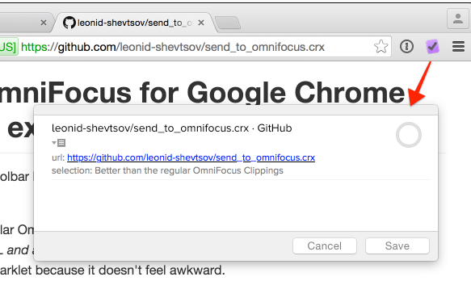

# Send to OmniFocus for Google Chrome (Unofficial extension)

[Send to Omnifocus at the Chrome Web Store](https://chrome.google.com/webstore/detail/send-to-omnifocus/ohdhaodomnlifoigpfcbjpcegdbefnen)

This extension adds a toolbar button that opens up the OmniFocus Quick Entry window for the current tab.

* Better than the regular OmniFocus Clippings and the Service because _this extension captures both the page's URL and any text you might have selected_.
* Better that a bookmarklet because it doesn't feel awkward.

---

(c) 2012-2017 Leonid Shevtsov

I am not affiliated with OmniGroup
